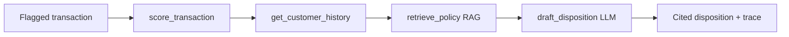

# Design — Fraud Investigation Copilot

## Flow

## LangGraph mapping
Each tool is a node in a StateGraph; edges follow score -> history -> retrieve -> draft.
State carries the transaction, probability, history summary, retrieved chunks, and trace.
The plain-Python loop in `copilot/investigate.py` is a drop-in equivalent; swapping in
LangGraph changes orchestration only, not the tools or the output contract.

## RAG
`corpus.load_chunks` -> section chunks; `TfidfRetriever` embeds with TF-IDF and ranks by
cosine similarity. `get_retriever()` is the seam for an embedding retriever.

## LLM adapter
`llm.draft_disposition` uses Anthropic when `ANTHROPIC_API_KEY` is set, else a rule-grounded
fallback. Both return the same JSON contract with citations.

## Interfaces
- `retriever.retrieve(query, k) -> list[Retrieved]`
- `investigate(txn, score_fn, history_df, retriever) -> Investigation`
