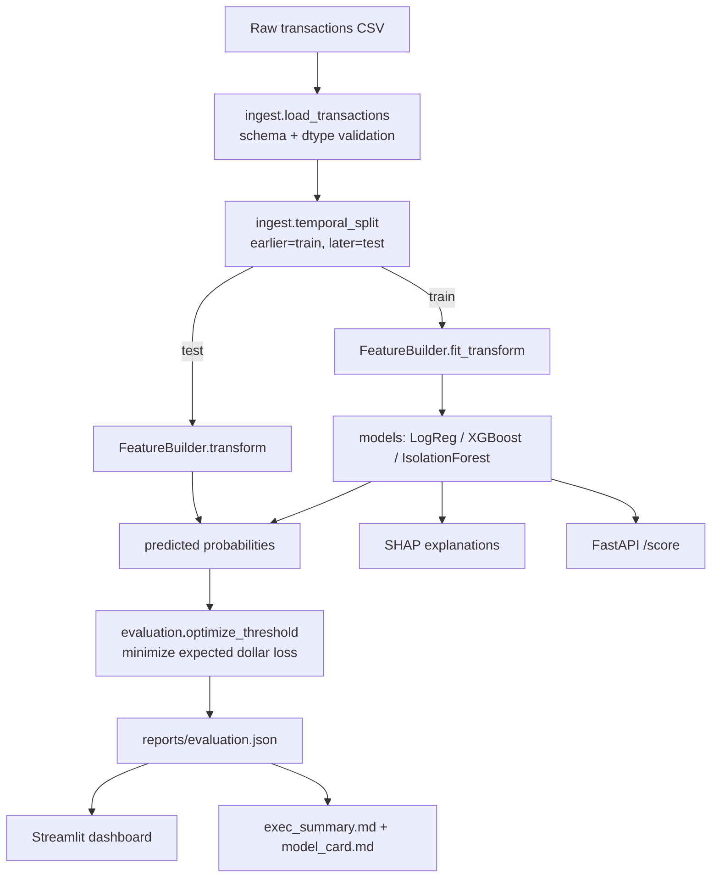

# Design — Fraud Detection Pipeline

## Overview
A modular, leakage-free pipeline: ingest → temporal split → causal feature engineering →
imbalance-aware training → cost-sensitive threshold optimization → evaluation & SHAP →
serving (API + dashboard) and business/model-card reporting.

## Data flow


## Cost model
Total cost at threshold t:
```
cost(t) = REVIEW_COST * (#alerts at t) + sum(amount_i for missed frauds at t)
```
`optimize_threshold` sweeps unique predicted probabilities (plus a fine grid) and returns
`argmin cost(t)` on the validation split, along with the full curve.

## Key interfaces
- `ingest.load_transactions(path) -> DataFrame`
- `ingest.temporal_split(df, train_frac) -> (train_df, test_df)`
- `FeatureBuilder.fit(train_df)`, `.transform(df) -> (X: DataFrame, y: Series, amount: Series)`
- `models.train_xgboost(X, y, seed) -> fitted model`  (and baseline/isoforest analogues)
- `evaluation.evaluate(y_true, y_prob, amount, review_cost) -> dict` (all R6 metrics)
- `evaluation.optimize_threshold(y_true, y_prob, amount, review_cost) -> (t*, curve)`

## Feature detail
| Feature | Source | Notes |
|---|---|---|
| distance_km | haversine(lat,long, merch_lat,merch_long) | customer↔merchant geo distance |
| hour, dow, is_night | trans_date_trans_time | temporal patterns |
| age | dob vs transaction date | risk varies with age |
| log_amt | amt | heavy-tailed amounts |
| amt_z_by_cat | amt grouped by category | fit on train only (no leakage) |
| velocity_24h | cc_num + unix_time | causal trailing 24h count |
| city_pop_log, gender, state, category | raw | encoded categoricals |

## Serving
- **API**: FastAPI loads the persisted XGBoost model + FeatureBuilder; `/score` accepts a
  transaction JSON, returns `{probability, decision, threshold}`.
- **Dashboard**: Streamlit renders the model comparison table, cost curve, calibration
  plot, SHAP importance, and the headline dollars-saved figure from `evaluation.json`.

## Error handling
Validation errors fail fast with actionable messages. Serving returns HTTP 422 on
malformed input. Threshold optimization guards against single-class inputs.
