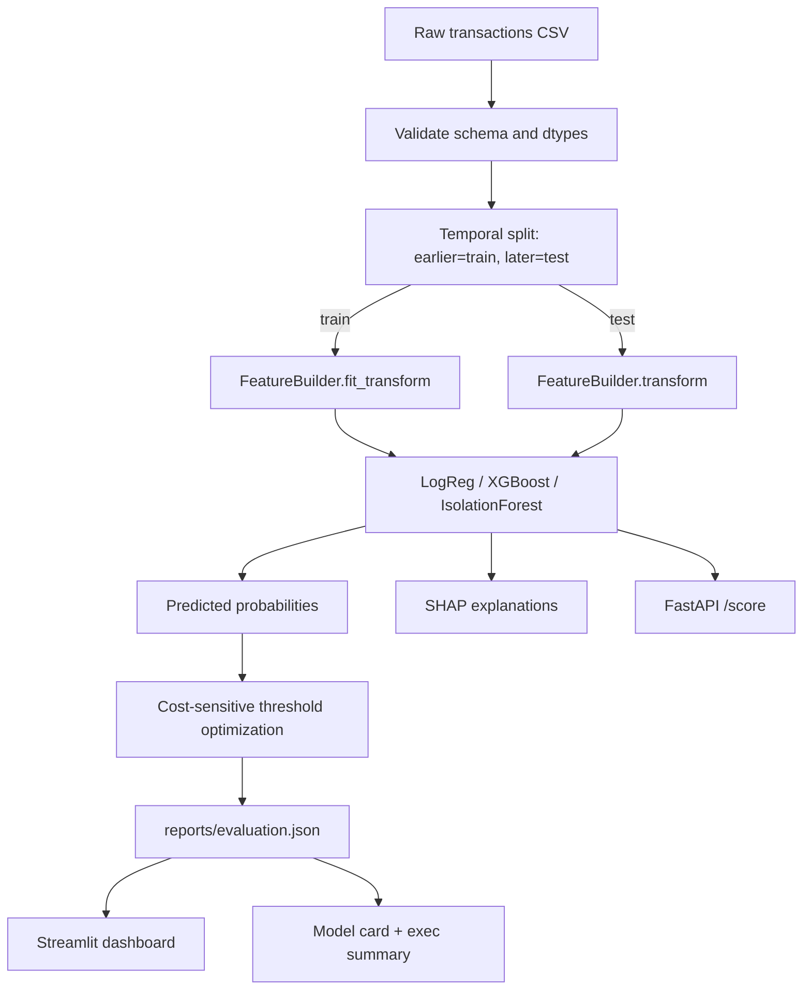

# Sentinel — Cost-Sensitive Credit Card Fraud Detection

[](https://github.com/USERNAME/sentinel-fraud-detection/actions)


> Fraud detection is not an accuracy problem — it's a **dollar problem**. Sentinel picks
> the decision threshold that **minimizes expected dollar loss**, not the one that
> maximizes AUC. On the target dataset it saves **$X per 100k transactions** versus a
> naive rule at the same analyst alert budget. *(Run `make all` to fill in X from your run.)*

Built with **Kiro** using spec-driven development — every requirement, design decision,
and task is version-controlled under `.kiro/`.

---

## Why this project stands out

This is a portfolio piece deliberately built to speak to three roles at once:

- **Data Scientist** — leakage-free temporal validation, class-imbalance handling,
  model calibration, SHAP explainability, tested and reproducible code.
- **Quant** — an explicit cost matrix, expected-loss derivation, cost-optimal threshold
  selection, and time-ordered backtesting.
- **Business Analyst** — an executive summary that leads with dollars saved, alert-budget
  tradeoffs, and a Streamlit dashboard for non-technical stakeholders.

## Architecture



## The economics (what makes it "quant")

Every decision is scored against a cost matrix (see `.kiro/steering/risk.md`):

| Actual \ Predicted | Legit | Fraud |
|--------------------|-------|-------|
| **Legit**          | $0    | review cost (false alarm) |
| **Fraud**          | transaction amount (missed) | review cost (caught) |

`total cost(t) = review_cost × alerts(t) + Σ amount of missed frauds(t)`

We sweep every candidate threshold and select `argmin cost(t)` — never the default 0.5.

## Quickstart

```bash
make setup      # install dependencies
make sample     # generate a tiny synthetic sample (offline; for tests/CI)
make train      # train models, persist artifacts
make evaluate   # metrics + cost-optimal threshold -> reports/evaluation.json
make model-card # governance model card from the evaluation
make dashboard  # Streamlit executive dashboard
make api        # FastAPI scoring service
make test lint  # tests with coverage + ruff
```

Run the whole thing on the sample with `make all`.

### Using the real dataset

The full [Sparkov dataset](https://www.kaggle.com/datasets/kartik2112/fraud-detection)
(~350 MB) is **not committed** — GitHub rejects files over 100 MB and raw data doesn't
belong in git. Fetch it with the Kaggle CLI and point the pipeline at it:

```bash
make data
export SENTINEL_DATA=data/raw/fraudTrain.csv
make train evaluate
```

## Results

Numbers below are produced by `make evaluate` and read from `reports/evaluation.json`.
*(The committed sample is synthetic and intentionally easy — real numbers come from the
Sparkov dataset.)*

| Model | PR-AUC | KS | Precision@k | Recall@budget | Expected loss |
|-------|--------|----|-------------|---------------|---------------|
| Logistic (calibrated) | — | — | — | — | — |
| XGBoost | — | — | — | — | — |
| Isolation Forest | — | — | — | — | — |

## How every Kiro feature is used

This project intentionally exercises the full Kiro workflow — see `.kiro/`:

| Kiro feature | Where | What it does here |
|--------------|-------|-------------------|
| **Spec-driven development** | `.kiro/specs/fraud-detection/` | requirements, design (+ data-flow diagram), granular tasks |
| **Steering** | `.kiro/steering/` | product, tech, structure, and fraud-economics (`risk.md`) context applied to every generation |
| **Agent hooks** | `.kiro/hooks/` | on-save lint+test, docs-in-sync on task completion, pre-commit PII/secret scan |
| **Agent skills** | `.kiro/skills/` | reusable `fraud-feature-engineering` and `model-card` skills with scripts |
| **MCP integration** | `.kiro/settings/mcp.json` | filesystem, git, and fetch servers |
| **Powers** | (enabled via Kiro UI) | AWS Documentation Power for deployment guidance |
| **Kiro Web** | stretch tasks | autonomous runs for hyperparameter search and drift monitoring |

## Repository structure

```
.kiro/            # specs, steering, hooks, skills, mcp — the Kiro workflow
src/sentinel/     # ingest, features, models, evaluation, train, evaluate, serving
tests/            # pytest (features + cost-sensitive evaluation)
scripts/          # data download + synthetic-sample generator
data/sample/      # tiny committed sample; real data is gitignored
reports/          # generated evaluation.json, model_card.md, plots
```

## License

MIT — see [LICENSE](LICENSE).
