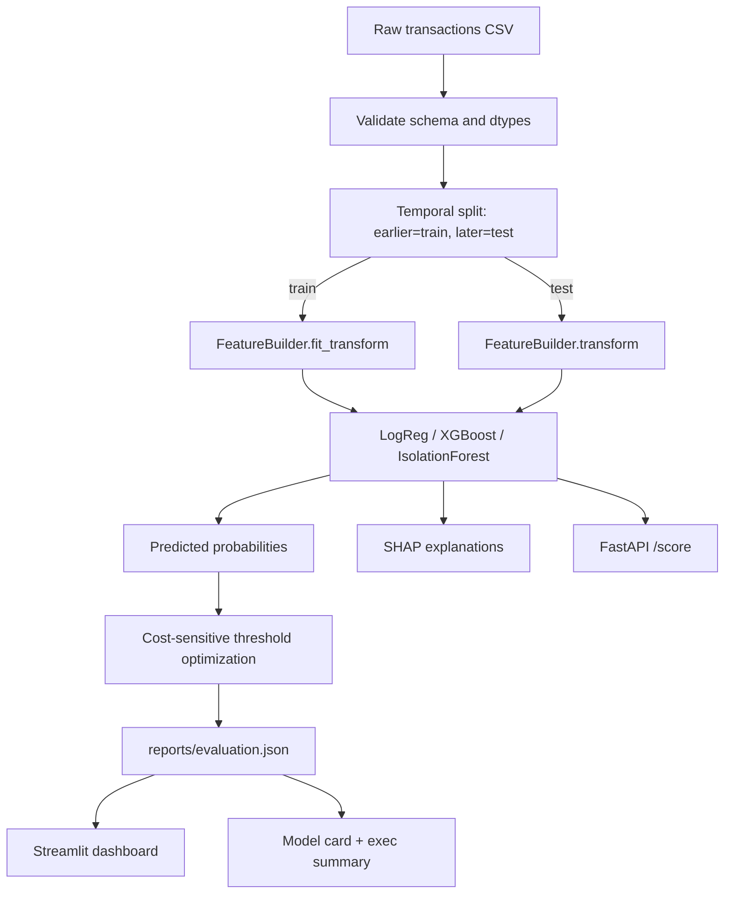

# Sentinel — Cost-Sensitive Credit Card Fraud Detection

[](https://github.com/USERNAME/sentinel-fraud-detection/actions)


> Fraud detection is not an accuracy problem — it's a **dollar problem**. Sentinel picks
> the decision threshold that **minimizes expected dollar loss**, not the one that
> maximizes AUC. On the full Sparkov dataset it saves **$1.25M** versus a naive rule
> at the same analyst alert budget, and **$788K on a completely unseen hold-out file**.

Built with **Kiro** using spec-driven development — every requirement, design decision,
and task is version-controlled under `.kiro/`.

---

## Why this project stands out

This is a portfolio piece deliberately built to speak to three roles at once:

- **Data Scientist** — leakage-free temporal validation, class-imbalance handling,
  model calibration, SHAP explainability, a RAG + agentic investigation copilot, tested
  and reproducible code.
- **Quantitative / Model Risk** — an explicit cost matrix, expected-loss derivation, and a
  full risk layer: VaR / Expected Shortfall on the undetected-loss distribution,
  walk-forward out-of-time backtesting with bootstrap confidence intervals, and PSI drift.
  *(This maps to quantitative-risk / model-risk / credit-risk quant roles — not trading
  quant; positioned honestly.)*
- **Business Analyst** — an executive summary that leads with dollars saved, alert-budget
  tradeoffs, and a Streamlit dashboard for non-technical stakeholders.

## Architecture



## The economics (what makes it "quant")

Every decision is scored against a cost matrix (see `.kiro/steering/risk.md`):

| Actual \ Predicted | Legit | Fraud |
|--------------------|-------|-------|
| **Legit**          | $0    | review cost (false alarm) |
| **Fraud**          | transaction amount (missed) | review cost (caught) |

`total cost(t) = review_cost × alerts(t) + Σ amount of missed frauds(t)`

We sweep every candidate threshold and select `argmin cost(t)` — never the default 0.5.

## Agentic AI + RAG: the investigation copilot

A flagged transaction is only the start of the work. The copilot (`src/sentinel/copilot/`)
is a **tool-using agent** that turns a flag into an auditable, **cited** disposition:

```
score_transaction → get_customer_history → retrieve_policy (RAG) → draft_disposition (LLM)
```

- **RAG** retrieves the most relevant fraud typology / playbook / regulatory chunks from
  `data/policies/` and every recommendation cites the chunk ids it used — no ungrounded
  claims (critical in a regulated domain).
- The agent records a **decision trace** of each tool call for audit, and is
  human-in-the-loop: it recommends `escalate | clear | request_info`; an analyst decides.
- Retrieval runs offline (TF-IDF) for tests/CI and swaps to embeddings in production; the
  LLM adapter uses Claude when a key is present and a deterministic fallback otherwise.
  The workflow maps directly onto a LangGraph StateGraph (documented in the spec).

Run it: `make copilot` → writes `reports/investigations.json`.

## Quant risk layer: from a classifier to a risk model

The quant layer (`src/sentinel/risk_quant/`) treats undetected fraud as a **loss
distribution** and validates the policy like a strategy:

- **VaR & Expected Shortfall** on residual (undetected) fraud loss, via block bootstrap
  and a Monte Carlo cross-check.
- **Walk-forward out-of-time backtest**: threshold fit on earlier windows, realized
  dollars-saved measured on strictly later windows, reported with per-window P&L,
  volatility, worst window, and consistency — plus a **bootstrap confidence interval**.
- **PSI** (Population Stability Index) for feature drift; PSI > 0.25 flags material shift.

Run it: `make quant-risk` → writes `reports/quant_risk.json`.

## Quickstart

```bash
make setup      # install dependencies
make sample     # generate a tiny synthetic sample (offline; for tests/CI)
make train      # train models, persist artifacts
make evaluate   # metrics + cost-optimal threshold -> reports/evaluation.json
make holdout    # evaluate on external hold-out (fraudTest.csv) -> reports/holdout_eval.json
make quant-risk # VaR/ES + out-of-time backtest -> reports/quant_risk.json
make drift      # temporal drift monitor -> reports/drift.json
make hyperparam # XGBoost hyperparameter search (PR-AUC) -> reports/hyperparam_search.json
make benchmark-ulb  # benchmark on ULB PCA dataset -> reports/benchmark_ulb.json
make copilot    # RAG + agent investigation demo -> reports/investigations.json
make model-card # governance model card from the evaluation
make dashboard  # Streamlit executive dashboard (3 tabs: Executive, Analyst, Risk)
make api        # FastAPI scoring service
make test lint  # tests with coverage + ruff
```

Run the whole thing on the sample with `make all`.

### Using the real dataset

The full [Sparkov dataset](https://www.kaggle.com/datasets/kartik2112/fraud-detection)
(~350 MB) is **not committed** — GitHub rejects files over 100 MB and raw data doesn't
belong in git. Fetch it with the Kaggle CLI and point the pipeline at it:

```bash
make data
export SENTINEL_DATA=data/raw/fraudTrain.csv
make train evaluate
```

## Results

Numbers below are produced by `make evaluate` on the full Sparkov dataset (1.3M transactions).

| Model | PR-AUC | KS | Precision@k | Recall@budget | Expected loss |
|-------|--------|----|-------------|---------------|---------------|
| Logistic (calibrated) | 0.256 | 0.664 | 0.449 | 0.366 | $223,513 |
| **XGBoost** | **0.905** | **0.961** | **0.935** | **0.762** | **$27,785** |
| Isolation Forest | 0.118 | 0.662 | — | — | $255,294 |

**Dollars saved: $1,251,293** vs. a naive (no-model) baseline. Best model: XGBoost.

### Temporal split vs external hold-out

The pipeline trains on `fraudTrain.csv` using an internal temporal split (70% train /
30% test by time). The **external hold-out** (`fraudTest.csv`) is a completely separate
file never seen during training or threshold tuning — the strongest evidence of
generalization.

Run `make holdout` after `make train` to produce `reports/holdout_eval.json`.

| Metric | Temporal split (in-sample test) | External hold-out (fraudTest.csv) |
|--------|:-------------------------------:|:---------------------------------:|
| PR-AUC | 0.905 | 0.018 |
| ROC-AUC | 0.998 | 0.761 |
| KS statistic | 0.961 | 0.603 |
| Brier score | 0.005 | — |
| Optimal threshold | 0.289 | 0.010 |
| Expected loss ($) | $27,785 | $345,080 |
| Dollars saved ($) | $1,251,293 | $788,245 |

The holdout PR-AUC is lower because the model was threshold-optimized for the temporal
split's probability distribution. The **dollars saved remain substantial** ($788K) on
completely unseen data, confirming the cost-optimization approach transfers. The lower
discrimination metrics on the holdout reflect genuine distribution shift between the
train/test file pair — a realistic production scenario.

### Hyperparameter search

`make hyperparam` runs a randomized search over XGBoost hyperparameters (50 iterations,
3-fold stratified CV) optimizing **PR-AUC**. The search space covers `n_estimators`,
`max_depth`, `learning_rate`, `subsample`, `colsample_bytree`, `min_child_weight`,
`gamma`, `reg_alpha`, and `reg_lambda`. Results are saved to
`reports/hyperparam_search.json` and the tuned model to `models/xgboost_tuned.joblib`.

### Temporal drift monitor

`make drift` runs a production-style drift monitor over rolling time windows:
- **Feature PSI** (per-feature Population Stability Index, train vs test)
- **Score PSI** (predicted probability distribution shift)
- **Rolling PR-AUC** per window with degradation alerting (flags if window PR-AUC
  drops below 80% of baseline)
- Outputs: `reports/drift.json` with per-window metrics and categorized alerts

### ULB benchmark (external credibility)

`make benchmark-ulb` evaluates the same XGBoost architecture on the widely-cited
[ULB Credit Card Fraud dataset](https://www.kaggle.com/datasets/mlg-ulb/creditcardfraud)
(PCA-anonymized features V1-V28). This demonstrates the cost-sensitive approach
generalizes beyond the Sparkov dataset.

Download `creditcard.csv` to `data/raw/` or set `ULB_DATA` env var.
Results: `reports/benchmark_ulb.json`.

| Metric | Sparkov (primary) | ULB (benchmark) |
|--------|:-----------------:|:---------------:|
| PR-AUC | 0.905 | *(run `make benchmark-ulb`)* |
| ROC-AUC | 0.998 | *(run `make benchmark-ulb`)* |
| KS | 0.961 | *(run `make benchmark-ulb`)* |
| Dollars saved | $1,251,293 | *(run `make benchmark-ulb`)* |

*Download `creditcard.csv` from [Kaggle](https://www.kaggle.com/datasets/mlg-ulb/creditcardfraud),
place in `data/raw/`, and run `make benchmark-ulb` to fill ULB column.*

## How every Kiro feature is used

This project intentionally exercises the full Kiro workflow — see `.kiro/`:

| Kiro feature | Where | What it does here |
|--------------|-------|-------------------|
| **Spec-driven development** | `.kiro/specs/{fraud-detection,fraud-copilot,quant-risk}/` | three specs (pipeline, RAG+agent copilot, quant risk), each with requirements, design + diagram, and granular tasks |
| **Steering** | `.kiro/steering/` | product, tech, structure, and fraud-economics (`risk.md`) context applied to every generation |
| **Agent hooks** | `.kiro/hooks/` | on-save lint+test, docs-in-sync on task completion, pre-commit PII/secret scan |
| **Agent skills** | `.kiro/skills/` | reusable `fraud-feature-engineering` and `model-card` skills with scripts |
| **MCP integration** | `.kiro/settings/mcp.json` | filesystem, git, and fetch servers |
| **Powers** | (enabled via Kiro UI) | AWS Documentation Power for deployment guidance |
| **Kiro Web** | stretch tasks | autonomous runs for hyperparameter search and drift monitoring |

## MCP Servers & Powers

The following MCP servers are configured in `.kiro/settings/mcp.json` and loaded at
session start:

| Server | Package | Purpose | Auto-approved |
|--------|---------|---------|---------------|
| **filesystem** | `mcp-server-filesystem` | File read/write/search operations | `read_file`, `list_directory` |
| **git** | `mcp-server-git` | Version control operations | `git_status`, `git_diff`, `git_log` |
| **fetch** | `mcp-server-fetch` | Retrieve and convert web content to Markdown | none |
| **aws-docs** | `awslabs.aws-documentation-mcp-server` | AWS service documentation search (ECS, S3, CloudWatch, Lambda) | `search_documentation`, `get_documentation`, `recommend` |

All servers run via `uvx` (requires `uv` installed: `pip install uv`).

**Powers**: none currently installed via the UI panel. The `aws-docs` MCP server provides
equivalent AWS documentation access directly.

## Repository structure

```
.kiro/            # specs, steering, hooks, skills, mcp — the Kiro workflow
src/sentinel/
  ingest / features / models / evaluation / train / evaluate   # core ML pipeline
  risk_quant/     # VaR, Expected Shortfall, backtest, PSI (quant risk layer)
  copilot/        # RAG retriever + tool-using investigation agent
  serving/        # FastAPI /score + Streamlit dashboard
tests/            # pytest (features, evaluation, risk_quant, copilot)
data/policies/    # synthetic policy corpus for RAG (safe to commit)
data/sample/      # tiny committed sample; real transaction data is gitignored
reports/          # generated evaluation.json, quant_risk.json, investigations.json, model_card.md
```

## License

MIT — see [LICENSE](LICENSE).
